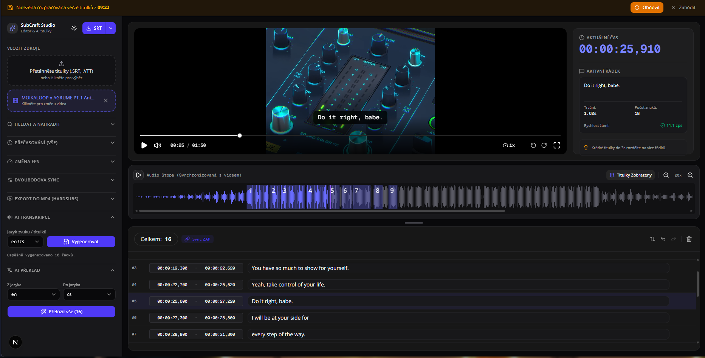

# 🎬 SubCraft Studio - AI-Powered Subtitle Editor

SubCraft Studio is a professional, browser-based subtitle editor built with Next.js. It leverages the power of client-side video processing (FFmpeg WebAssembly) and advanced AI (Google Cloud Vertex AI) to provide automated transcription, translation, and hardsub burning—all within a highly optimized, VS Code-like interface.



## ✨ Key Features

### 🤖 AI-Powered Workflow (Google Vertex AI & Gemini)
*   **Auto-Transcription:** Extracts audio via FFmpeg in the browser, chunks it optimally, and uses Gemini 3.5 Flash for high-accuracy word-level timestamp generation.
*   **Context-Aware Translation:** Streams translations in real-time. The AI is prompted with strict constraints to maintain character personas, formal/informal tones, and correct movie dialogue pacing.
*   **Rate-Limit Resiliency:** Built-in exponential backoff and retry queues to gracefully handle API quotas (`429 Quota Exceeded`).

### ⚡ Advanced Client-Side Processing
*   **FFmpeg.wasm Integration:** Audio extraction, format conversion, and Hardsub burning (burning subtitles directly into the `.mp4` video stream) are processed entirely in the user's browser. Zero backend video upload required.
*   **Audio Waveform:** Integrates `wavesurfer.js` for precise visual audio representation, perfectly synced with the HTML5 video player and subtitle regions.

### 🎨 Pro-Level UI/UX (React & TanStack)
*   **Virtualized DOM:** Uses `@tanstack/react-virtual` to render thousands of subtitle lines with zero performance lag.
*   **Smart Selection & State:** Multi-select (Shift-click / Ctrl-click), merging, splitting (Ctrl+Enter), and complete Undo/Redo history via custom hooks.
*   **VS Code-Style Minimap:** Search functionality highlights results directly on a custom scrollbar minimap.
*   **Time Shifting & FPS Sync:** Complex math utilities for linear synchronization (2-point sync) and FPS conversions (e.g., 23.976 to 25 FPS).

## 🛠️ Tech Stack

*   **Framework:** Next.js (App Router), React 18+
*   **Styling:** Tailwind CSS, shadcn/ui, Lucide Icons
*   **AI Integration:** `@google/genai` (Vertex AI / Gemini API)
*   **Media Processing:** `@ffmpeg/ffmpeg` (WebAssembly), `wavesurfer.js`
*   **State & Performance:** Zustand/React Context, TanStack Virtualizer

## 🚀 Getting Started

### Prerequisites
*   Node.js 18+
*   A Google Cloud Project with Vertex AI enabled, or a Google AI Studio API key.

### Installation

1. Clone the repository:
   ```bash
   git clone https://github.com/yourusername/subcraft-studio.git
   cd subcraft-studio
   ```

2. Install dependencies:
   ```bash
   npm install
   ```

3. Set up environment variables:
   Copy `.env.example` to `.env.local` and add your Google Cloud credentials.
   ```bash
   cp .env.example .env.local
   ```

4. Run the development server:
   ```bash
   npm run dev
   ```

5. Open [http://localhost:3000](http://localhost:3000) with your browser to see the result.

## 🧠 Architecture Highlights

*   **Audio Chunking Strategy:** To bypass API payload limits, large audio tracks are sliced into 2-minute raw PCM WAV chunks in the browser before being sent to the transcription API.
*   **Lookahead AI Pacing:** The backend uses lookahead algorithms on word-level timestamps to group words into natural, readable subtitle blocks based on sentence endings, pauses, and a maximum CPS (Characters Per Second) limit.
*   **Streaming Translations:** Uses `ReadableStream` and NDJSON (Newline Delimited JSON) to stream translated batches to the frontend, updating the UI instantly rather than waiting for the entire movie to be translated.

## 📄 License
This project is open-sourced under the MIT License.